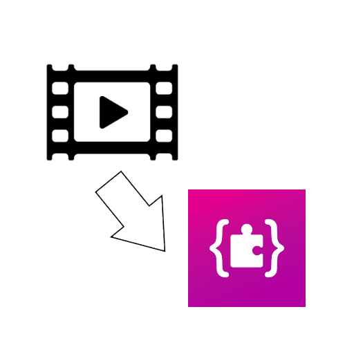

  <h1>Video to Arcade</h1>
  <h3>A website/PWA to convert multiple video frames in MakeCode Arcade code to paste.</h3>

___
# About
This website allows people to convert multiple video frames to JavaScript code that can be copy-pasted into a MakeCode Arcade project. All it does is to take each image and convert it to an image that uses the MakeCode Arcade color palette. The website is [online](https://video.arcade.apexie.eu) and can be installed as a PWA. This project is based on kristianpedersen's work.